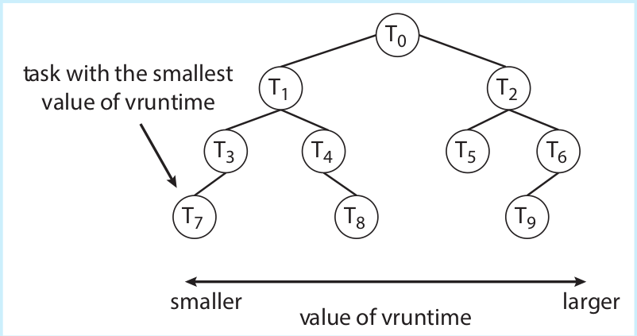
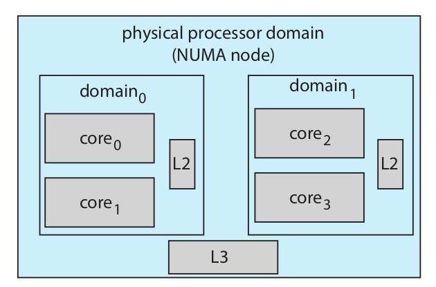

# Actividad 7
# Completely Fair Scheduler (CFS) de Linux.
Antes del Completely Fair Scheduler (CFS), el kernel de Linux utilizaba el algoritmo O(1), que ofrecía un rendimiento excelente en sistemas SMP (multiprocesador simétrico), pero resultaba ineficiente para procesos interactivos, como los que se ejecutan en computadoras de escritorio. El CFS fue introducido en la versión 2.6.23 del kernel para abordar estos problemas.

## Características principales del CFS
Su objetivo es distribuir el tiempo de CPU de manera justa entre todas las tareas activas en el sistema. A diferencia de los planificadores tradicionales que usan prioridades estrictas y tiempos de ejecución fijos (slices), el CFS asigna una proporción del tiempo de CPU a cada tarea dependiendo de su valor de nice, que varía de -20 (mayor prioridad) a +19 (menor prioridad).

Una característica clave del CFS es que no trabaja con prioridades explícitas, sino que utiliza un concepto de tiempo de ejecución virtual (vruntime) para decidir qué tarea debe ejecutarse, las tareas con menor vruntime tienen prioridad sobre aquellas con mayor valor (Scheduling).
El vruntime se ajusta de acuerdo con la prioridad de la tarea: si una tarea tiene mayor prioridad, su vruntime crecerá más lentamente en comparación con las tareas de menor. 

El CFS utiliza un árbol rojo-negro (red-black tree) para almacenar las tareas que están listas para ejecutarse. El nodo más a la izquierda del árbol (con el vruntime más bajo) representa la tarea con la mayor prioridad, que será la siguiente en ejecutarse. Este diseño garantiza que el CFS seleccione la tarea correcta en tiempo O(log N), donde N es el número de tareas

## Funcionamiento del CFS
El CFS asigna una proporción de tiempo de CPU a cada tarea en función de su valor de nice. Las tareas con un valor de nice menor reciben más tiempo de CPU, mientras que aquellas con un valor mayor reciben menos. El valor vruntime se ajusta dependiendo de la prioridad de la tarea: una tarea de alta prioridad acumula vruntime más lentamente que una de baja prioridad.

El CFS también utiliza el concepto de latencia objetivo (targeted latency), que representa el intervalo de tiempo durante el cual todas las tareas deberían ejecutarse al menos una vez. Si el número de tareas activas aumenta, el valor de la latencia objetivo también lo hace, para asegurar una distribución justa del tiempo de CPU entre las tareas.
## Balanceo de carga
El CFS incluye un mecanismo de load balancing entre los diferentes núcleos del procesador. Evalúa la carga de cada núcleo en función de una combinación de la prioridad de cada hilo y el promedio de uso de CPU. Esto le permite distribuir la carga de manera eficiente entre los diferentes núcleos, lo que es especialmente importante en sistemas multiprocesador. En sistemas NUMA (Non-Uniform Memory Access), el CFS es consciente de la topología de la memoria y evita migraciones de tareas entre diferentes nodos NUMA para minimizar las penalizaciones de latencia en el acceso a la memoria.

En situaciones normales, el CFS prefiere migrar tareas dentro de un mismo dominio (grupo de núcleos que comparten caché), y solo cuando hay un desequilibrio significativo en la carga permite la migración entre nodos NUMA, lo cual podría incurrir en mayores tiempos de acceso a la memoria.

---
#### Allan Gomez - 202005035

